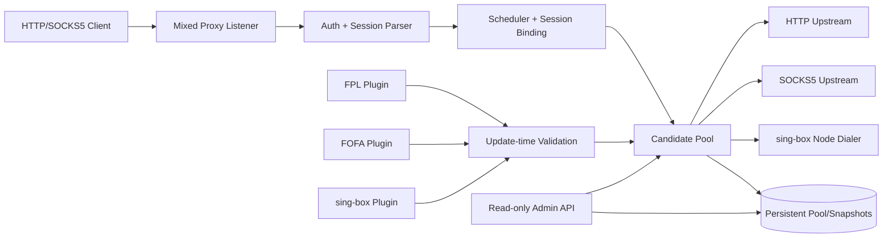
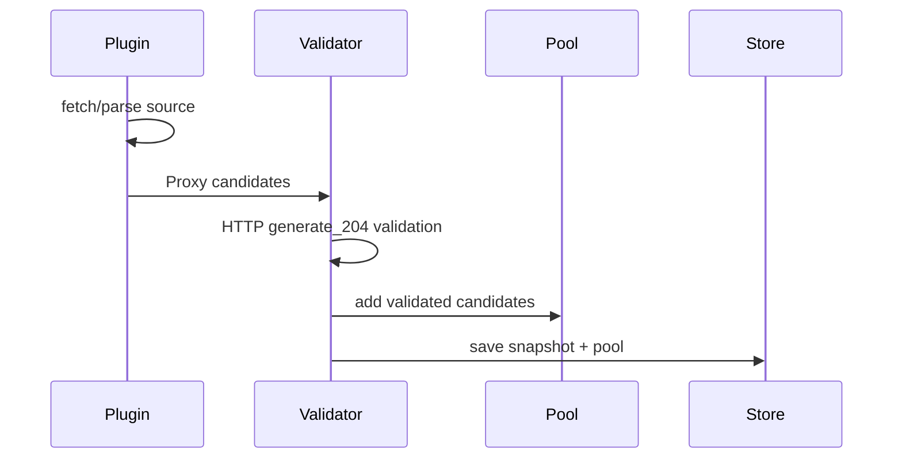
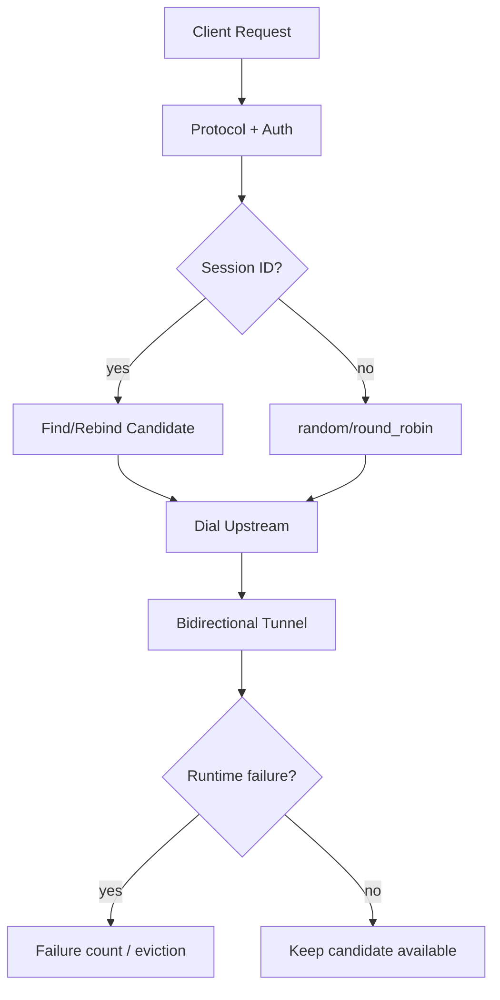
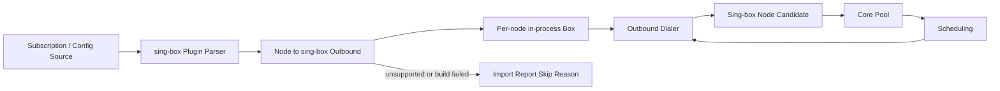
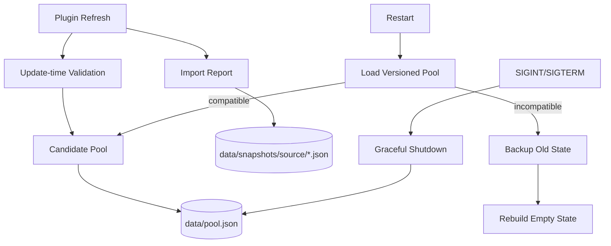
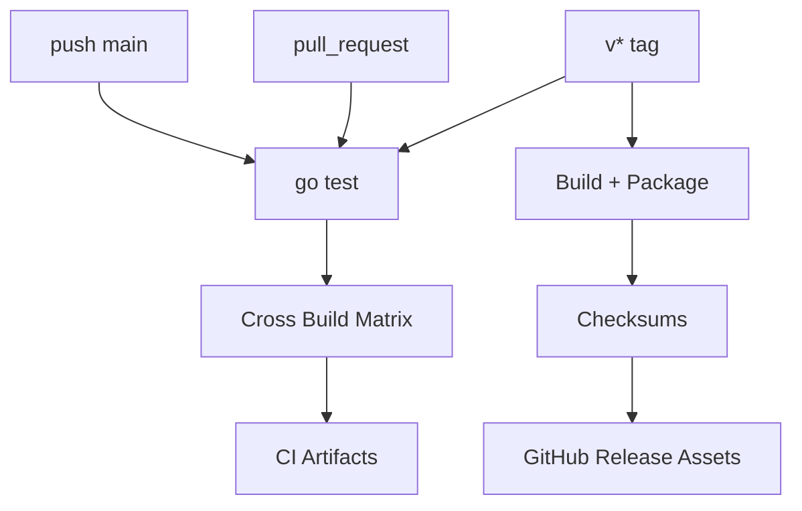

# AIOPROXY 拓扑

## 总体架构



## 刷新与入池



## 请求调度



## sing-box 节点桥接



说明：sing-box 依赖只在插件内使用；主体只看到标准 candidate 与 dialer，不依赖 sing-box 类型。每个可启动节点对应独立候选，不为每个节点预注册本地端口。

## 持久化与快照



说明：sessions 不持久化；持久化状态带版本，不兼容时备份旧文件并继续启动。

## Admin API 可观测面

```mermaid
flowchart LR
  Operator[Operator] --> Admin[Read-only Admin API]
  Admin --> Health[/health]
  Admin --> Stats[/stats]
  Admin --> PoolView[/pool]
  Admin --> Plugins[/plugins]
  Admin --> Snapshots[/snapshots]
  Health --> Pool[Pool Counts]
  Health --> PluginState[Plugin Degradation]
  Plugins --> Reports[Import Reports]
  PoolView --> Basic[Basic Candidate Info]
```

说明：Admin API 不提供刷新/删除/修改；只返回基础运行信息，不返回 FOFA key、代理密码、完整订阅 URL 或 raw node。

## 发布构建流



说明：main push 产出 CI artifacts；`v*` tag 才创建正式 GitHub Release。v1 发布 Linux/macOS/Windows 的 amd64 与 arm64 二进制包。
