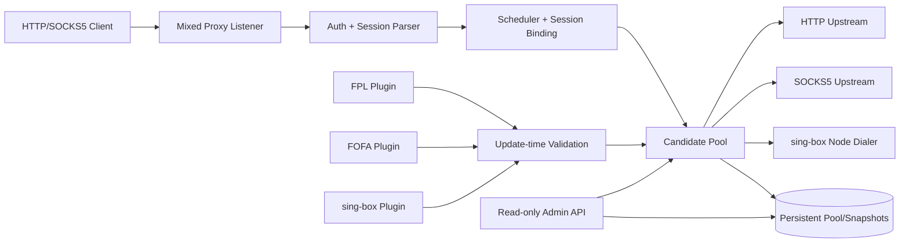
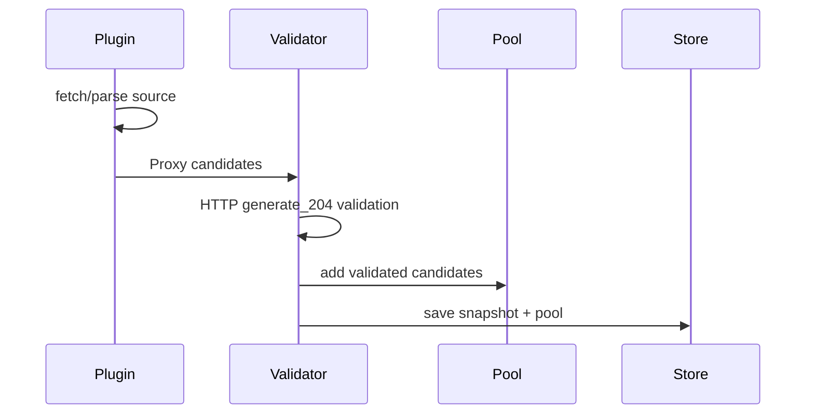
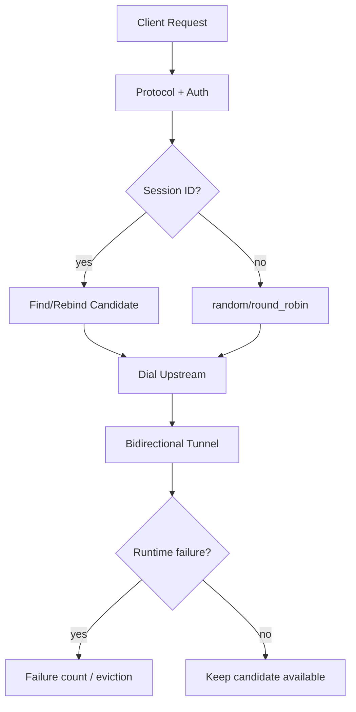

# AIOPROXY 拓扑

## 总体架构

```mermaid
flowchart LR
  Client[HTTP/SOCKS5 Client] --> Mixed[Mixed Proxy Listener]
  Mixed --> Auth[Auth + Session Parser]
  Auth --> Scheduler[Scheduler + Session Binding]
  Scheduler --> Pool[Candidate Pool]
  Pool --> HTTP[HTTP Upstream]
  Pool --> SOCKS[SOCKS5 Upstream]
  Pool --> SB[sing-box Node Dialer]
  FPL[FPL Plugin] --> Validate[Update-time Validation]
  FOFA[FOFA Plugin] --> Validate
  SING[sing-box Plugin] --> Validate
  Validate --> Pool
  Pool --> Store[(Persistent Pool/Snapshots)]
  Admin[Read-only Admin API] --> Pool
  Admin --> Store
```

## 刷新与入池

```mermaid
sequenceDiagram
  participant Plugin
  participant Validator
  participant Pool
  participant Store
  Plugin->>Plugin: fetch/parse source
  Plugin->>Validator: Proxy candidates
  Validator->>Validator: HTTP generate_204 validation
  Validator->>Pool: add validated candidates
  Validator->>Store: save snapshot + pool
```

## 请求调度

```mermaid
flowchart TD
  Req[Client Request] --> Parse[Protocol + Auth]
  Parse --> Sess{Session ID?}
  Sess -- yes --> Bind[Find/Rebind Candidate]
  Sess -- no --> Policy[random/round_robin]
  Bind --> Dial[Dial Upstream]
  Policy --> Dial
  Dial --> Tunnel[Bidirectional Tunnel]
  Tunnel --> Fail{Runtime failure?}
  Fail -- yes --> Evict[Failure count / eviction]
  Fail -- no --> OK[Keep candidate available]
```
